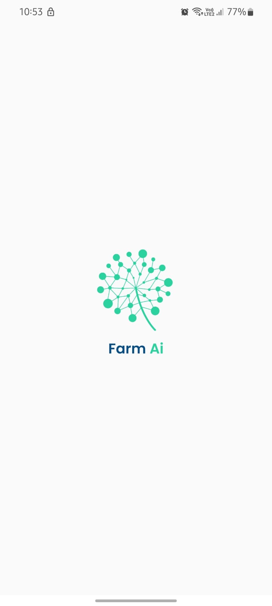
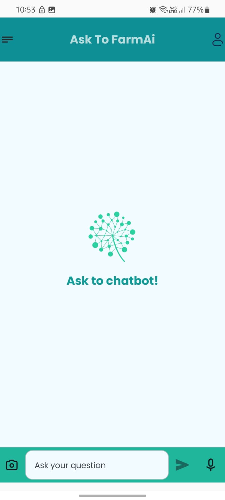
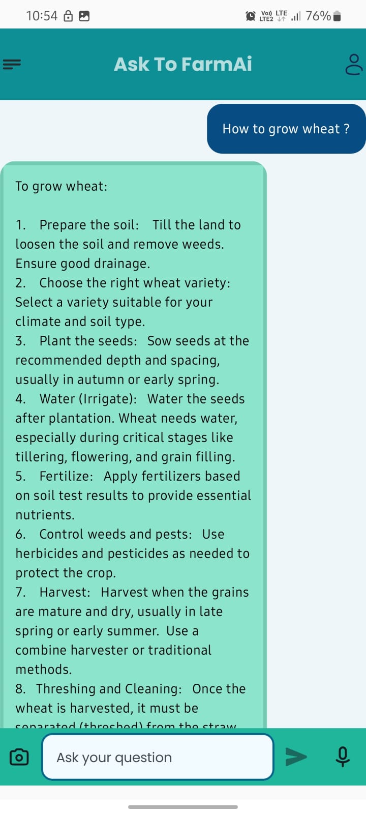
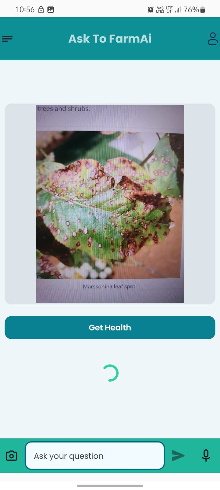
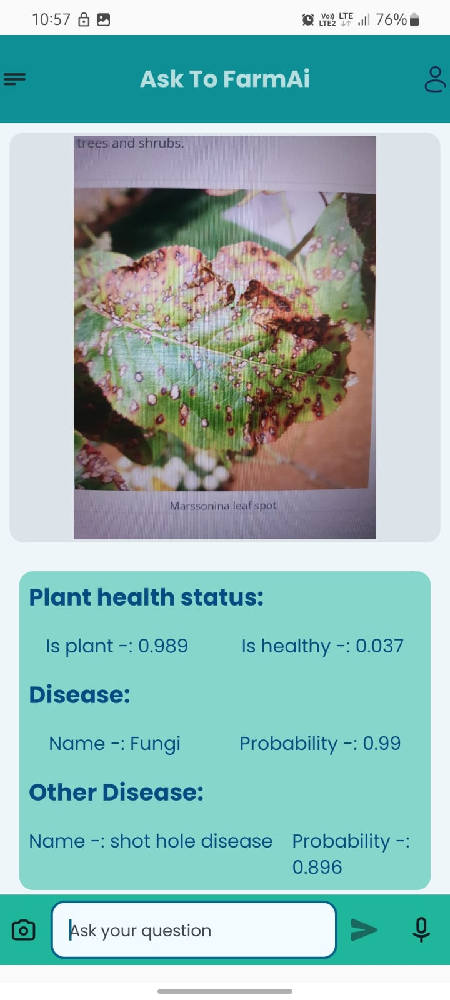

<h1 align="center">🌾 FarmAi - Your Smart Farming Assistant 🌿</h1>

  
  <strong> Kotlin</strong>

  
  <strong> Jetpack Compose</strong>

  
  <strong> Gemini API (Google AI)</strong>

  
  <strong> Plant.id API</strong>

  
  <strong> Android</strong>

  
  <strong> Retrofit</strong>

---

## 🌟 Overview

**FarmAi** is an Android app designed to assist farmers with:
- 💬 **Text-based crop query resolution** using the **Gemini AI** API
- 🌱 **Plant disease detection** via **image upload** using the **Plant.id API**

The goal is to empower farmers with AI-driven insights for day-to-day decision making.

---

## 🚀 Tools & Technologies Used

| Technology       | Purpose                        |
|------------------|--------------------------------|
| Kotlin           | Main programming language       |
| Jetpack Compose  | Modern UI toolkit               |
| Gemini API       | AI-powered text query handling  |
| Plant.id API     | Image-based plant disease detection |
| Retrofit         | RESTful API networking          |

---

## 📱 App Screenshots

<table>
  <tr>
    <td></td>
    <td></td>
    <td></td>
  </tr>
  <tr>
    <td align="center">Splash Screen</td>
    <td align="center">Home Screen</td>
    <td align="center">Text Query</td>
  </tr>
</table>

<table>
  <tr>
    <td></td>
    <td></td>
  </tr>
  <tr>
    <td align="center">Image Upload</td>
    <td align="center">Detection Result</td>
  </tr>
</table>

---

## 🎥 App Demo

  

> 🔗 Replace `YOUR_VIDEO_ID` with your actual YouTube video ID.

---

## 🙌 Acknowledgements

- [Gemini API](https://ai.google.dev/)
- [Plant.id](https://web.plant.id/)
- [Jetpack Compose](https://developer.android.com/jetpack/compose)

---

